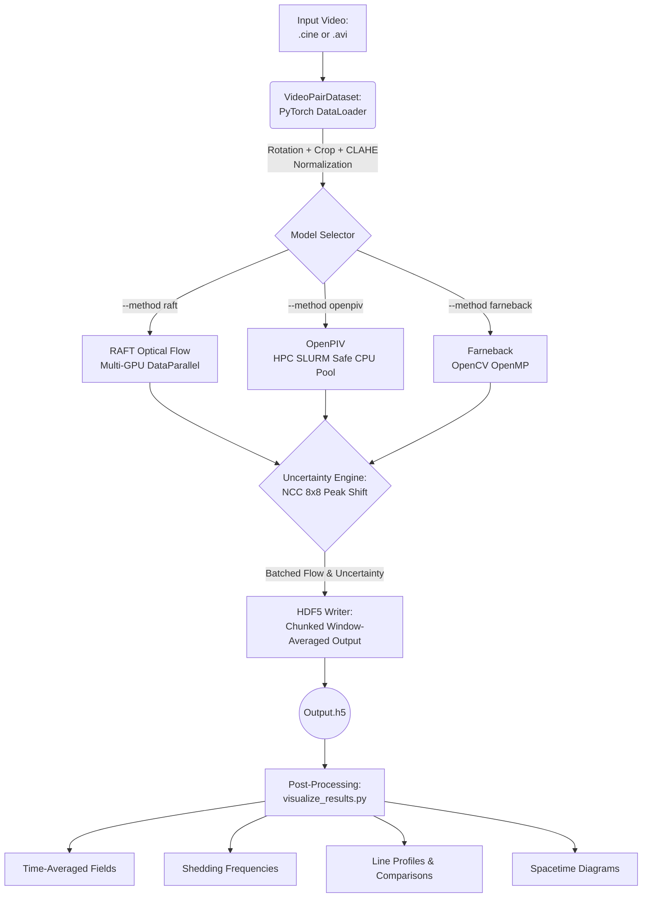

# Modular High-Speed PIV and Optical Flow Pipeline
## `velocimetry_for_multiphase`

This repository implements a high-speed, batch-processed Optical Flow and Particle Image Velocimetry (PIV) pipeline. It is specifically designed to handle large, uncompressed `.cine` and `.avi` files (up to tens of gigabytes), process them efficiently using GPU batching (RAFT) or CPU multi-processing (OpenPIV), and save the results dynamically to chunked HDF5 files to prevent memory exhaustion.

It features integrated Live Uncertainty Estimation and a rich suite of post-processing and visualization tools.

---

## Architecture Flowchart



---

## 🚀 Running Velocimetry (Inference)

The main entry point for inference is `tracker.py`.

### 1. RAFT Optical Flow (Deep Learning, Single-GPU)
RAFT is the most accurate method. It requires a trained `.pth` weight file (placed in `./weights/`).

```bash
python tracker.py \
  --method raft \
  --model c1.pth \
  --path data/recording_1.cine \
  --use_clahe
```

### 2. OpenPIV (Classical PIV, Multi-CPU)
OpenPIV runs on the CPU. It features an HPC-safe parallelization strategy that automatically detects your SLURM core allocation to prevent node oversubscription.

```bash
python tracker.py \
  --method openpiv \
  --path data/recording_1.avi \
  --use_clahe
```

### 3. Farneback (Classical Optical Flow)
Fast, baseline optical flow based on OpenCV's internal implementations.

```bash
python tracker.py \
  --method farneback \
  --path data/recording_1.cine \
  --use_clahe
```

### Common Inference Arguments
- `--frames N`: Only process the first `N` frames (useful for testing). Default `-1` (all).
- `--roi y1 y2 x1 x2`: Crop the video before processing. E.g., `--roi 0 -1 200 800`.
- `--use_clahe`: Apply Contrast Limited Adaptive Histogram Equalization to the video.
- `--win_h X --win_w Y`: Average the dense flow fields spatially into `X` by `Y` blocks before saving to HDF5. Default `4 4`.
- `--throat_loc y x`: Pass the pixel coordinates of the throat to save to metadata (required for some downstream post-processing).
- `--rotate_angle DEG`: Pre-rotate the image by `DEG` degrees (CCW) around `--throat_loc` before cropping. Useful for aligning sloped walls horizontally. Default `0.0`. Requires `--throat_loc`.

---

## 📊 Post-Processing & Visualization

The `visualize_results.py` script bridges the `.h5` output with physical analysis. 

> **Prerequisite:** You must supply the original `--video` alongside the generated `--h5` for single-file analysis so the visualizer can construct spatial axes correctly based on video dimensions.

### 1. Basic Inspections (Fields of View)

**Velocity & Uncertainty Contour Fields:**
Generates translucent heat-map overlays for either velocity magnitude or uncertainty mapping.

```bash
# Instantaneous Velocity Contour Video
python visualize_results.py \
  --video data/recording_1.cine \
  --h5 data/recording_1_raft.h5 \
  --contour

# Instantaneous Uncertainty Contour Video
python visualize_results.py \
  --video data/recording_1.cine \
  --h5 data/recording_1_raft.h5 \
  --contour \
  --dataset uncertainty \
  --alpha 0.6

# Time-Averaged Fields (Velocity & Reynolds Stresses images)
python visualize_results.py \
  --h5 data/recording_1_raft.h5 \
  --average
```

**Quiver Field (Vector Map):**
Overlays flow vectors onto the images, rigorously anchored to their respective physical spatial integration windows (e.g. 8x8 block centers).
```bash
# Generate a full .mp4 Quiver Video (Requires original video to match spatial dims)
python visualize_results.py \
  --video data/recording_1.cine \
  --h5 data/recording_1_raft.h5 \
  --quiver --quiver_skip 16 --quiver_scale 4.0

# Generate a single instantaneous high-res PNG Quiver Image (e.g. at Frame 100)
python visualize_results.py \
  --video data/recording_1.cine \
  --h5 data/recording_1_raft.h5 \
  --quiver --frame 100
```

**Animated U-Profile Overlay Video:**
Generates an MP4 video appending 10 equidistant instantaneous U-velocity profiles physically overlaid onto the flow.
```bash
python visualize_results.py \
  --video data/recording_1.cine \
  --h5 data/recording_1_raft.h5 \
  --profile_video \
  --fps 10
```

### 2. Multiphase Measurements

**Shedding Frequency (FFT):**
Calculates the shedding frequency using FFT over the spatially-averaged temporal V components.
```bash
python visualize_results.py \
  --video data/recording_1.cine \
  --h5 data/recording_1_raft.h5 \
  --frequency --plot
```

**Vapor Cavity Length:**
Tracks the bounding length of the phase/cavity over time, extracting the mean and standard deviations.
```bash
python visualize_results.py \
  --video data/recording_1.cine \
  --h5 data/recording_1_raft.h5 \
  --cavity --plot
```

**Spacetime Diagram:**
Creates a spacetime tracking diagram evaluated along the centerline of the flow.
```bash
python visualize_results.py \
  --video data/recording_1.cine \
  --h5 data/recording_1_raft.h5 \
  --spacetime
```

### 3. Spatial Line Extractions (Data Export)

To compare specific geometrical points, you can extract 1D lines of data mapped downstream of the `throat_loc`. By default, this will compute **time-averaged** profiles (U, V) and Reynolds Stresses (UU, VV, UV) over all frames.

If you specify a single `--frame N`, it will instead extract the **instantaneous velocity** profile for that specific snapshot without temporal averaging constraints.

```bash
# Extract profiles at 0mm, 1.5mm, 3mm, 5mm, 10mm, and 15mm downstream of throat X
python visualize_results.py \
  --video data/recording_1.cine \
  --h5 data/recording_1_raft.h5 \
  --profiles 0 1.5 3 5 10 15 \
  --angle 0 \
  --throat_loc 331 85 \
  --frame 100
```
This generates a lighter-weight `_lines.h5` containing strictly these array profiles.

### 4. Cross-Method Comparisons

Once line profiles (`_lines.h5`) are extracted from multiple methods/cases, compare them directly. This generates publication-ready stacked plots across the specified coordinates.

```bash
# Compare U-velocity profiles between Farneback, OpenPIV, and RAFT with uncertainty bounds
python visualize_results.py \
  --compare 48_fb_lines.h5 48_piv_lines.h5 48_raft_lines.h5 \
  --labels Farneback OpenPIV RAFT-Sintel \
  --prop u \
  --show_uncertainty
```
*(Valid `--prop` options: `u`, `v`, `uu`, `uv`, `vv`, `uncert`)*

## 🎓 Running on VT ARC HPC Cluster (Falcon)

Since large multiphase videos (like `.cine` files) can take up hundreds of gigabytes, processing them on HPC clusters using the **SLURM workload manager** is highly recommended. The Virginia Tech ARC Falcon cluster features GPUs suitable for the RAFT machine learning algorithm.

### 1. Account and Allocation
1. The first step is to have an ARC account and get access to an Allocation through your Professor.
2. To see details of your ARC account, go to [coldfront.arc.vt.edu](https://coldfront.arc.vt.edu).
3. If you don’t see any allocations other than `Personal`, ask your professor to provide one. Most likely it will be `Cavitation`.

### 2. Accessing the Terminal and Loading Modules
After you get the ARC account running, visit [ood.arc.vt.edu](https://ood.arc.vt.edu) to access the clusters and data. 
We can access the linux terminal through **ood.arc.vt.edu -> Clusters -> Falcon Shell Access**. The Linux Terminal will open in a new window.

Before algorithm execution, we must configure a Python environment. First, load the explicitly required Python and CUDA modules:
```bash
module load Python/3.12.3-GCCcore-13.3.0 CUDA/12.6.0
```

### 3. Setting Up Your Python Environment
In the terminal, type the following command to create a virtual environment (you can choose your own name):
```bash
python3 -m venv NAME-OF-THE-ENV
```

Activate the environment for this terminal session:
```bash
source ~/NAME-OF-THE-ENV/bin/activate
```

Install the required packages strictly after activation:
```bash
pip3 install numpy scipy tqdm pyarrow pandas fastparquet opencv-python torch matplotlib h5py pims openpiv
```

### 4. Cloning the Repository
After all the prerequisites are met, we can run the code. If not done before, create an account on GitHub and fork the repository (or directly clone it):
```bash
git clone https://github.com/ChNagaNitish/optical-flow-cloud-cavitation.git
cd optical-flow-cloud-cavitation
```

### 5. SLURM Submission Script (`jobScript.sh`)
You cannot directly run the heavy PyTorch/Optical Flow scripts on ARC login nodes. You must use SLURM to create a job and submit it to the queue, specifying required resources (like GPUs).

Save the following block as `jobScript.sh`. You might have to run `chmod +x jobScript.sh` to make it executable.

```bash
#!/bin/bash
# 
#SBATCH -t 0-02:00:00 
#SBATCH -N 1 
#SBATCH --account=cavitation 
#SBATCH --partition=a30_normal_q 
#SBATCH --gres=gpu:1 
#SBATCH --mail-user=your-email@vt.edu 
#SBATCH --mail-type=ALL 
#SBATCH --job-name=raft48 
 
# Loading required modules 
module purge 
module reset 
module load GCC/13.3.0 Python/3.12.3-GCCcore-13.3.0 
module load CUDA/12.6.0 

# Activate environment
source "$HOME/NAME-OF-THE-ENV/bin/activate" 

# Run the algorithm
python3 tracker.py --method raft --model weights/raft-sintel.pth --path /home/your-pid/experiment/48.avi 
```
*Note: This script asks for 1 GPU using the "cavitation" account and "a30_normal_q" partition for 2 hours.*

Submit the job to the cluster scheduler using:
```bash
sbatch jobScript.sh
```
*You can check your job status by using `squeue -u <Your-PID>` to see whether it is running or still in the queue.*

---

## 🗃️ Data Transfer via SFTP

Secure File Transfer Protocol (`sftp`) creates a secure connection to transfer files (like your processed `.h5` results or plots) between your local machine (e.g., your laptop or Windows Subsystem for Linux (WSL)) and the ARC HPC clusters. *More details can be found at [docs.arc.vt.edu](https://docs.arc.vt.edu/usage/data_transfer.html).*

### 1. Establishing the Connection 
Open your **local** terminal and run the following command. You will likely be prompted for your password and 2-factor authentication (Duo). 
```bash
sftp your-PID@datatransfer.arc.vt.edu
```
*Note: When you are successful, your command prompt will change to `sftp>`.*

### 2. Navigation
SFTP allows you to navigate two filesystems simultaneously. Standard commands affect the Remote system (ARC), and commands prefixed with **`l`** (for "local") affect your Local machine.

| Action | Remote Command (ARC) | Local Command (Your PC) |
|---|---|---|
| List Files | `ls` | `lls` |
| Print Working Directory | `pwd` | `lpwd` |
| Change Directory | `cd directory_name` | `lcd directory_name` |
| Make Directory | `mkdir new_folder` | `lmkdir new_folder` |

**Examples:**
Check where you are: 
```bash
pwd   # Shows path on ARC (e.g., /home/your-PID/) 
lpwd  # Shows path on local machine (e.g., /mnt/c/Users/You/Documents)
```
If you are using Windows Subsystem for Linux (WSL), you can access your Windows drives via the `/mnt/` mount point:
```bash
lcd /mnt/c/Users/YourName/Desktop
```

### 3. Transferring Files
The core commands are `get` (download from ARC) and `put` (upload to ARC).

**Downloading (ARC $\rightarrow$ Local):**
```bash
get filename.txt                   # Single File
get -r RemoteDirectoryName         # Entire Directory (recursive)
```

**Uploading (Local $\rightarrow$ ARC):**
```bash
put data_file.csv                  # Single File
put -r LocalDirectoryName          # Entire Directory (recursive)
```

### 4. File Management & Exiting 
You can perform basic file management without leaving the SFTP session:
- **Rename a remote file:** `rename old_name new_name` 
- **Delete a remote file:** `rm filename` *(Warning: there is no "trash bin" in CLI)* 
- **Delete a remote directory:** `rmdir directory_name` 
- **Exit the session:** Type `exit`, `bye`, or `quit` to return to your standard shell.

---

## 📐 Appendix A: Uncertainty Quantification Methodology

This section details the mathematical basis for the live per-frame uncertainty estimation and its downstream propagation to time-averaged flow statistics (mean velocity and Reynolds stresses).

### 1. Per-Frame Uncertainty Estimation

The uncertainty of individual displacement vectors is computed using **NCC Peak Shift Analysis** — a correlation-based method inspired by PIV Correlation Statistics (Wieneke, 2015).

After the optical flow algorithm predicts a displacement field, frame 2 is backward-warped onto frame 1 using the predicted flow. In a perfect measurement, the warped frame would exactly match frame 1. We then search a local $8 \times 8$ window of integer pixel shifts around the warped position and compute the Normalized Cross-Correlation (NCC) at each shift. The sub-pixel peak of this NCC surface — found via 3-point Gaussian fitting — indicates where the *true* best match lies. The distance between this peak and the zero-shift position (where the tracker placed it) is the uncertainty.

1.  **Backward Warp**: Frame 2 is warped using the predicted flow: $I_2^w = \text{Warp}(I_2, \mathbf{F}_{12})$
2.  **NCC Search**: For each integer shift $(\Delta x, \Delta y) \in [-4, +4]$, compute the local windowed NCC:  
    $$ R(\Delta x, \Delta y) = \text{NCC}(I_1, \text{Shift}(I_2^w, \Delta x, \Delta y)) $$
3.  **Sub-Pixel Peak**: A 3-point Gaussian fit along each axis locates the sub-pixel peak $\delta$:  
    $$ \delta = \frac{\ln R_{-1} - \ln R_{+1}}{2(\ln R_{-1} + \ln R_{+1} - 2 \ln R_0)} $$
4.  **Uncertainty**: The peak shift magnitude is the per-pixel uncertainty:  
    $$ \sigma_u(t) = |\delta_u|, \quad \sigma_v(t) = |\delta_v| $$

This method directly measures how far the tracker's prediction deviates from where correlation analysis says the true match is, making it sensitive to algorithm quality rather than image texture.

### 2. Propagation to Time-Averaged Statistics

When computing time-averaged properties from a sequence of $T$ frames, the per-frame measurement uncertainties $\sigma(t)$ mathematically propagate to the final statistics. We assume the measurement error $\epsilon(t)$ is modeled by a zero-mean Gaussian $\epsilon(t) \sim \mathcal{N}(0, \sigma^2(t))$.

#### 2.1 Mean Velocity Uncertainty
The time-averaged velocity $\bar{u}$ is:
$$ \bar{u} = \frac{1}{T} \sum_{t=1}^{T} u(t) $$

The variance of the mean, assuming independent measurement errors, is the sum of variances scaled by $1/T^2$:
$$ \sigma_{\bar{u}} = \frac{1}{T} \sqrt{\sum_{t=1}^{T} \sigma_u^2(t)} $$

*Note: For large $T$, this value appropriately decreases as $1/\sqrt{T}$. Even in highly unsteady flow, random measurement error averages out; physical unsteadiness is preserved in the Reynolds stresses instead.*

#### 2.2 Reynolds Stress Uncertainty
The Reynolds normal stress $\langle u'u' \rangle$ is defined as the variance of the velocity fluctuations:
$$ \langle u'u' \rangle = \frac{1}{T} \sum_{t=1}^{T} (u(t) - \bar{u})^2 $$

Using standard error propagation (delta method):
$$ \sigma_{\langle u'u' \rangle} = \frac{2}{T} \sqrt{\sum_{t=1}^{T} (u(t) - \bar{u})^2 \sigma_u^2(t)} $$

Correlation terms like shear stress $\langle u'v' \rangle$ follow a similar derivation, accounting for errors in both $u$ and $v$:
$$ \sigma_{\langle u'v' \rangle} = \frac{1}{T} \sqrt{\sum_{t=1}^{T} \left[ (v(t) - \bar{v})^2 \sigma_u^2(t) + (u(t) - \bar{u})^2 \sigma_v^2(t) \right]} $$

### 3. Summary of Equations

| Quantity | Symbol | Uncertainty Formula |
| :--- | :--- | :--- |
| **Instantaneous Velocity** | $u(t)$ | $\sigma_u(t) = \|\delta_u\|$ (NCC 8×8 peak shift) |
| **Mean Velocity** | $\bar{u}$ | $\sigma_{\bar{u}} = \frac{1}{T} \sqrt{\sum \sigma_u^2(t)}$ |
| **Reynolds Normal Stress** | $\langle u'u' \rangle$ | $\sigma_{\langle u'u' \rangle} = \frac{2}{T} \sqrt{\sum (u-\bar{u})^2 \sigma_u^2(t)}$ |
| **Reynolds Shear Stress** | $\langle u'v' \rangle$ | $\sigma_{\langle u'v' \rangle} = \frac{1}{T} \sqrt{\sum [ (v-\bar{v})^2 \sigma_u^2(t) + (u-\bar{u})^2 \sigma_v^2(t) ]}$ |
