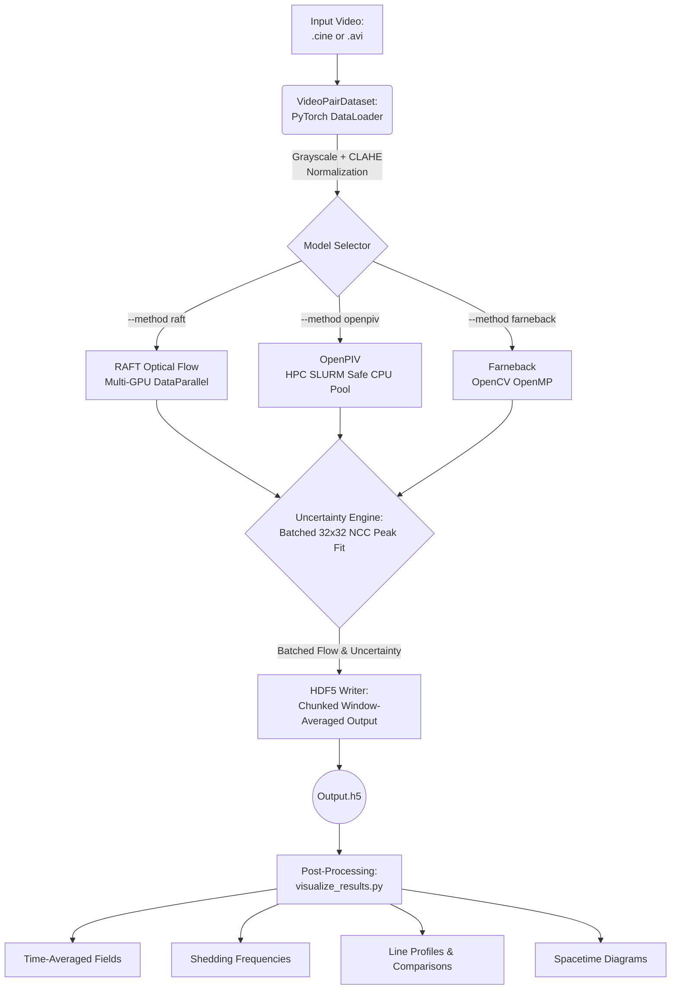

# Modular High-Speed PIV and Optical Flow Pipeline
## `velocimetry_for_multiphase`

This repository implements a high-speed, batch-processed Optical Flow and Particle Image Velocimetry (PIV) pipeline. It is specifically designed to handle large, uncompressed `.cine` and `.avi` files (up to tens of gigabytes), process them efficiently using GPU batching (RAFT) or CPU multi-processing (OpenPIV), and save the results dynamically to chunked HDF5 files to prevent memory exhaustion.

It features integrated Live Uncertainty Estimation and a rich suite of post-processing and visualization tools.

---

## Architecture Flowchart



---

## 🚀 Running Velocimetry (Inference)

The main entry point for inference is `tracker.py`.

### 1. RAFT Optical Flow (Deep Learning, Multi-GPU)
RAFT is the most accurate method. It requires a trained `.pth` weight file (placed in `./weights/`). It automatically scales across multiple GPUs using `--batch_size`.

```bash
python tracker.py \
  --method raft \
  --model c1.pth \
  --path data/recording_1.cine \
  --batch_size 4 \
  --use_clahe
```

### 2. OpenPIV (Classical PIV, Multi-CPU)
OpenPIV runs on the CPU. It features an HPC-safe parallelization strategy that automatically detects your SLURM core allocation to prevent node oversubscription.

```bash
python tracker.py \
  --method openpiv \
  --path data/recording_1.avi \
  --batch_size 16 \
  --use_clahe
```

### 3. Farneback (Classical Optical Flow)
Fast, baseline optical flow based on OpenCV's internal implementations.

```bash
python tracker.py \
  --method farneback \
  --path data/recording_1.cine \
  --use_clahe
```

### Common Inference Arguments
- `--frames N`: Only process the first `N` frames (useful for testing). Default `-1` (all).
- `--roi y1 y2 x1 x2`: Crop the video before processing. E.g., `--roi 0 -1 200 800`.
- `--use_clahe`: Apply Contrast Limited Adaptive Histogram Equalization to the video.
- `--win_h X --win_w Y`: Average the dense flow fields spatially into `X` by `Y` blocks before saving to HDF5. Default `4 4`.
- `--throat_loc y x`: Pass the pixel coordinates of the throat to save to metadata (required for some downstream post-processing).

---

## 📊 Post-Processing & Visualization

The `visualize_results.py` script bridges the `.h5` output with physical analysis. 

> **Prerequisite:** You must supply the original `--video` alongside the generated `--h5` for single-file analysis so the visualizer can construct spatial axes correctly based on video dimensions.

### 1. Basic Inspections (Fields of View)

**Time-Averaged Velocity Contour Field:**
Generates a `_contour.png` map of the mean magnitude velocity over all frames.
```bash
python visualize_results.py \
  --video data/recording_1.cine \
  --h5 data/recording_1_raft.h5 \
  --contour \
  --average
```

**Quiver Field (Vector Map):**
Overlays flow vectors onto the time-averaged field.
```bash
python visualize_results.py \
  --video data/recording_1.cine \
  --h5 data/recording_1_raft.h5 \
  --quiver --quiver_skip 16 --quiver_scale 3.0 \
  --average
```

### 2. Multiphase Measurements

**Shedding Frequency (FFT):**
Calculates the shedding frequency using FFT over the spatially-averaged temporal V components.
```bash
python visualize_results.py \
  --video data/recording_1.cine \
  --h5 data/recording_1_raft.h5 \
  --frequency --plot
```

**Vapor Cavity Length:**
Tracks the bounding length of the phase/cavity over time, extracting the mean and standard deviations.
```bash
python visualize_results.py \
  --video data/recording_1.cine \
  --h5 data/recording_1_raft.h5 \
  --cavity --plot
```

**Spacetime Diagram:**
Creates a spacetime tracking diagram evaluated along the centerline of the flow.
```bash
python visualize_results.py \
  --video data/recording_1.cine \
  --h5 data/recording_1_raft.h5 \
  --spacetime
```

### 3. Spatial Line Extractions (Data Export)

To compare specific geometrical points, you can extract 1D lines of data (U, V, UU, UV, VV, UUID_UNCERT) mapped downstream of the `throat_loc`.

```bash
# Extract profiles at 0mm, 1.5mm, 3mm, 5mm, 10mm, and 15mm downstream of throat X
python visualize_results.py \
  --video data/recording_1.cine \
  --h5 data/recording_1_raft.h5 \
  --profiles 0 1.5 3 5 10 15 \
  --angle 0 \
  --throat_loc 331 85
```
This generates a lighter-weight `recording_1_raft_lines.h5` containing strictly these array profiles.

### 4. Cross-Method Comparisons

Once line profiles (`_lines.h5`) are extracted from multiple methods/cases, compare them directly. This generates publication-ready stacked plots across the specified coordinates.

```bash
# Compare U-velocity profiles between Farneback, OpenPIV, and RAFT
python visualize_results.py \
  --compare 48_fb_lines.h5 48_piv_lines.h5 48_raft_lines.h5 \
  --labels Farneback OpenPIV RAFT-Sintel \
  --prop u
```
*(Valid `--prop` options: `u`, `v`, `uu`, `uv`, `vv`, `uncert`)*

## 🎓 Running on HPC Clusters (SLURM)

Since large multiphase videos (like `.cine` files) can take up hundreds of gigabytes, processing them on HPC clusters using the **SLURM workload manager** is highly recommended. 

The pipeline is designed to be SLURM-aware:
- **RAFT** scales automatically across all GPUs you request.
- **OpenPIV** automatically reads SLURM's `--cpus-per-task` to prevent node oversubscription and getting killed by the system admin.

### SLURM Submission Script (`submit_velocimetry.sh`)

Save the following block as `submit_velocimetry.sh` in your project folder. Adjust the partition, time, and memory based on your university/company's cluster configuration.

```bash
#!/bin/bash
#SBATCH --job-name=raft_multiphase
#SBATCH --nodes=1
#SBATCH --ntasks=1
#SBATCH --cpus-per-task=8               # 8 CPU cores for data loading + OpenPIV fallback
#SBATCH --gres=gpu:a100:2               # Request 2 A100 GPUs (RAFT will use both automatically)
#SBATCH --mem=64G                       # Allocate 64GB of RAM (Required for large .cine files)
#SBATCH --time=12:00:00                 # Maximum 12 hour runtime
#SBATCH --output=logs/velocimetry_%j.out # Standard output log
#SBATCH --error=logs/velocimetry_%j.err  # Error log

# 1. Load your HPC environments
module purge
module load anaconda3/2023.03
module load cuda/11.8

# 2. Activate Python environment
source activate multiphase_env

# 3. Create logs directory if it doesn't exist
mkdir -p logs

# 4. Run the Pipeline! (GPU Array Batching)
# Note: Using batch_size=4 means (Batch 4 / 2 GPUs) -> 2 pairs on GPU 0, 2 pairs on GPU 1
python tracker.py \
    --method raft \
    --model c1.pth \
    --path /data/experiments/session_1/highspeed_001.cine \
    --batch_size 4 \
    --use_clahe \
    --throat_loc 331 85
```

Submit it to your cluster scheduler using:
```bash
sbatch submit_velocimetry.sh
```

---

## 📦 Setting Up Your Environment
For new students joining the lab, setting up the exact environment is critical to ensure `pims` can read `.cine` files and `torch` can see the GPUs.

**1. Create the Conda Environment:**
```bash
conda create -n multiphase_env python=3.10 -y
conda activate multiphase_env
```

**2. Install PyTorch with CUDA support** 
*(Check your local system for the correct CUDA version command at pytorch.org)*:
```bash
pip install torch torchvision torchaudio --index-url https://download.pytorch.org/whl/cu118
```

**3. Install Data Processing Libraries:**
```bash
pip install numpy scipy matplotlib tqdm h5py opencv-python pims
```

**4. Install OpenPIV:**
```bash
pip install openpiv
```
